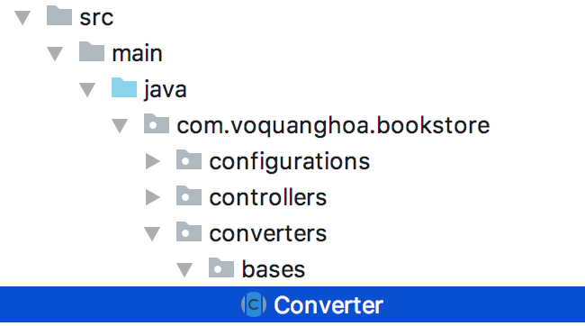

# Converter

## Các loại model

Cùng một thông tin dữ liệu nhưng tùy theo phạm vi mà ta sẽ có các lớp model khác nhau như:

- DAO (Data Access Object): Thông tin lưu vào database
- DTO (Data Transfer Object): Thông tin giao tiếp với client

Ví dụ dưới đây, cùng là thông tin về sách nhưng nếu lưu trong database ta sẽ có một class model riêng, đây là class `dao`:

```java
package com.voquanghoa.bookstore.models.dao;

import lombok.Data;
import lombok.NoArgsConstructor;
import lombok.NonNull;
import lombok.RequiredArgsConstructor;

import javax.persistence.*;
import javax.validation.constraints.Max;
import javax.validation.constraints.Min;
import javax.validation.constraints.NotBlank;

@Data
@Entity
@NoArgsConstructor
@RequiredArgsConstructor
public class Book {

    @Id
    @GeneratedValue(strategy= GenerationType.AUTO)
    private int id;

    @NonNull
    @NotBlank(message = "Name is mandatory")
    private String name;

    @ManyToOne
    private Author author;

    @Min(value = 1990, message = "Invalid year")
    @Max(value = 2100, message = "Invalid year")
    private int year;
}
```

Với dữ liệu tương tác với client, ta sẽ có class DTO (Data Transfer Object)

```java
package com.voquanghoa.bookstore.models.dto;

import lombok.Data;

import javax.validation.constraints.Max;
import javax.validation.constraints.Min;
import javax.validation.constraints.NotBlank;

@Data
public class BookDTO {
    int id;

    @NotBlank(message = "Name is mandatory")
    String name;


    int authorId;

    @Min(value = 1990, message = "Invalid year")
    @Max(value = 2100, message = "Invalid year")
    int year;
}
```

## Converter cơ sở

Để tạo các converter, ta cần có một lớp cơ sở `Converter` trong package `converter.base`



```java
import java.util.List;
import java.util.stream.Collectors;

public abstract class Converter<S, T> {

    public abstract T convert(S source);

    public List<T> convert(List<S> sources){
        return sources.stream().map(this::convert).collect(Collectors.toList());
    }
}
```

Ở đây, lớp `BadRequestException` được khai báo trong package `exceptions` như sau:

```java
import org.springframework.http.HttpStatus;
import org.springframework.web.bind.annotation.ResponseStatus;

@ResponseStatus(code = HttpStatus.BAD_REQUEST)
public class BadRequestException extends RuntimeException {

    public BadRequestException(String reason){
        super(reason);
    }
}
```

Unit test

```java

import com.voquanghoa.bookstore.converters.bases.Converter;
import com.voquanghoa.bookstore.exceptions.BadRequestException;
import org.junit.Test;
import org.junit.runner.RunWith;
import org.springframework.beans.factory.annotation.Autowired;
import org.springframework.boot.autoconfigure.EnableAutoConfiguration;
import org.springframework.boot.test.autoconfigure.web.servlet.AutoConfigureMockMvc;
import org.springframework.boot.test.context.SpringBootTest;
import org.springframework.stereotype.Component;
import org.springframework.test.context.junit4.SpringRunner;
import org.springframework.test.context.web.WebAppConfiguration;

import java.util.Arrays;
import java.util.List;

import static org.junit.Assert.assertEquals;


@Component
class SampleConverter extends Converter<String, Integer> {

    @Override
    public Integer convert(String source) throws BadRequestException {
        return Integer.parseInt(source);
    }
}

@RunWith(SpringRunner.class)
@SpringBootTest
@AutoConfigureMockMvc
@WebAppConfiguration
@EnableAutoConfiguration(exclude = {org.springframework.boot.autoconfigure.gson.GsonAutoConfiguration.class})
public class ConverterTest {

    @Autowired
    private SampleConverter sampleConverter;

    @Test
    public void test_convert_List(){

        String[] numbers = new String[]{"1", "2", "3"};

        List<Integer> result = sampleConverter.convert(Arrays.asList(numbers));

        assertEquals(result, Arrays.asList(1, 2, 3));
    }
}
```

## Converter

Ta implement hai class `BookDaoToBookDtoConverter` và `BookDtoToBookDaoConverter` để convert qua lại giữa book dao và book dto như sau

```java

import com.voquanghoa.bookstore.converters.bases.Converter;
import com.voquanghoa.bookstore.exceptions.BadRequestException;
import com.voquanghoa.bookstore.models.dao.Book;
import com.voquanghoa.bookstore.models.dto.BookDTO;
import org.springframework.stereotype.Component;

@Component
public class BookDaoToBookDtoConverter extends Converter<Book, BookDTO> {

    @Override
    public BookDTO convert(Book source) throws BadRequestException {

        BookDTO bookDTO = new BookDTO();
        bookDTO.setId(source.getId());
        bookDTO.setName(source.getName());
        bookDTO.setYear(source.getYear());

        if(source.getAuthor() != null){
            bookDTO.setAuthorId(source.getAuthor().getId());
        }

        return bookDTO;
    }
}
```

```java

import com.voquanghoa.bookstore.converters.bases.Converter;
import com.voquanghoa.bookstore.exceptions.BadRequestException;
import com.voquanghoa.bookstore.models.dao.Author;
import com.voquanghoa.bookstore.models.dao.Book;
import com.voquanghoa.bookstore.models.dto.BookDTO;
import com.voquanghoa.bookstore.repositories.AuthorRepository;
import org.springframework.beans.factory.annotation.Autowired;
import org.springframework.stereotype.Component;

import java.util.Optional;

@Component
public class BookDtoToBookDaoConverter extends Converter<BookDTO, Book> {

    @Autowired
    private AuthorRepository authorRepository;


    @Override
    public Book convert(BookDTO source) {

        Book book = new Book();

        book.setYear(source.getYear());
        book.setId(source.getId());
        book.setName(source.getName());

        if(source.getAuthorId() > 0){
            Optional<Author> author = authorRepository.findById(source.getAuthorId());

            if(author.isPresent()){
                book.setAuthor(author.get());
            }else{
                throw new BadRequestException("Invalid author id " + source.getAuthorId());
            }
        }

        return book;
    }
}
```

Unit test

```java

import com.voquanghoa.bookstore.converters.bases.Converter;
import com.voquanghoa.bookstore.models.dao.Author;
import com.voquanghoa.bookstore.models.dao.Book;
import com.voquanghoa.bookstore.models.dto.BookDTO;
import org.junit.Test;
import org.junit.runner.RunWith;
import org.springframework.beans.factory.annotation.Autowired;
import org.springframework.boot.autoconfigure.EnableAutoConfiguration;
import org.springframework.boot.test.autoconfigure.web.servlet.AutoConfigureMockMvc;
import org.springframework.boot.test.context.SpringBootTest;
import org.springframework.test.context.junit4.SpringRunner;
import org.springframework.test.context.web.WebAppConfiguration;

import static org.junit.Assert.assertEquals;

@RunWith(SpringRunner.class)
@SpringBootTest
@AutoConfigureMockMvc
@WebAppConfiguration
@EnableAutoConfiguration(exclude = {org.springframework.boot.autoconfigure.gson.GsonAutoConfiguration.class})
public class BookDaoToBookDtoConverterTest {

    @Autowired
    private Converter<Book, BookDTO> bookDaoToBookDtoConverter;

    @Test
    public void test_Convert(){
        Author author = new Author();
        author.setId(12);

        Book book = new Book();
        book.setAuthor(author);
        book.setName("Book name");
        book.setId(13);
        book.setYear(2010);

        BookDTO bookDTO = bookDaoToBookDtoConverter.convert(book);

        assertEquals(bookDTO.getAuthorId(), 12);
        assertEquals(bookDTO.getName(), "Book name");
        assertEquals(bookDTO.getId(), 13);
        assertEquals(bookDTO.getYear(), 2010);
    }
}
```

```java

import com.voquanghoa.bookstore.converters.bases.Converter;
import com.voquanghoa.bookstore.models.dao.Author;
import com.voquanghoa.bookstore.models.dao.Book;
import com.voquanghoa.bookstore.models.dto.BookDTO;
import com.voquanghoa.bookstore.repositories.AuthorRepository;
import org.junit.Before;
import org.junit.Test;
import org.junit.runner.RunWith;
import org.springframework.beans.factory.annotation.Autowired;
import org.springframework.boot.autoconfigure.EnableAutoConfiguration;
import org.springframework.boot.test.autoconfigure.web.servlet.AutoConfigureMockMvc;
import org.springframework.boot.test.context.SpringBootTest;
import org.springframework.test.context.junit4.SpringRunner;
import org.springframework.test.context.web.WebAppConfiguration;

import static org.junit.Assert.assertEquals;

@RunWith(SpringRunner.class)
@SpringBootTest
@AutoConfigureMockMvc
@WebAppConfiguration
@EnableAutoConfiguration(exclude = {org.springframework.boot.autoconfigure.gson.GsonAutoConfiguration.class})
public class BookDtoToBookDaoConverterTest {

    @Autowired
    private Converter<BookDTO, Book> bookDtoToBookDaoConverter;

    @Autowired
    private AuthorRepository authorRepository;

    private Author author;

    @Before
    public void init(){
        author = new Author();
        author.setEmail("email@domain.com");
        author.setName("Author");
        author= authorRepository.save(author);

    }

    @Test
    public void test_convert(){
        BookDTO bookDTO = new BookDTO();
        bookDTO.setName("Book");
        bookDTO.setYear(2010);
        bookDTO.setId(12);

        Book book = bookDtoToBookDaoConverter.convert(bookDTO);
        assertEquals(book.getId(), 12);
        assertEquals(book.getName(), "Book");
        assertEquals(book.getYear(), 2010);


        bookDTO.setAuthorId(author.getId());

        book = bookDtoToBookDaoConverter.convert(bookDTO);
        assertEquals(book.getAuthor().getId(), author.getId());
    }
}
```

Sử dụng trong controller

```java

import com.voquanghoa.bookstore.converters.bases.Converter;
import com.voquanghoa.bookstore.exceptions.NotFoundException;
import com.voquanghoa.bookstore.models.dao.Book;
import com.voquanghoa.bookstore.models.dto.BookDTO;
import com.voquanghoa.bookstore.repositories.BookRepository;
import org.springframework.beans.factory.annotation.Autowired;
import org.springframework.data.domain.Sort;
import org.springframework.web.bind.annotation.*;

import javax.validation.Valid;
import java.util.Optional;

@RestController
@RequestMapping("/api/books")
public class BookController {

    @Autowired
    private Converter<BookDTO, Book> bookDTOBookConverter;

    @Autowired
    private Converter<Book, BookDTO> bookBookDTOConverter;

    @Autowired
    private BookRepository bookRepository;

    @GetMapping("/{id}")
    public BookDTO get(@PathVariable int id){
        Optional<Book> optionalBook = bookRepository.findById(id);

        if(optionalBook.isPresent()){
            return bookBookDTOConverter.convert(optionalBook.get());
        }

        throw new NotFoundException(String.format("Book id %d not found", id));
    }


    @DeleteMapping("/{id}")
    void delete(@PathVariable int id){

        if(!bookRepository.existsById(id)){
            throw new NotFoundException(String.format("Book id %d not found", id));
        }

        bookRepository.deleteById(id);
    }

    @GetMapping
    public Iterable<BookDTO> get(){
        return  bookBookDTOConverter.convert(bookRepository.findAll(Sort.by(Sort.Direction.ASC, "id")));
    }

    @PostMapping()
    public void post(@Valid @RequestBody BookDTO book){
        book.setId(0);
        bookRepository.save(bookDTOBookConverter.convert(book));
    }

    @GetMapping("/find")
    public Iterable<Book> find(@RequestParam String name){
        return bookRepository.findByNameContaining(name);
    }

    @PutMapping()
    public void put(@RequestBody Book book){
        bookRepository.save(book);
    }
}
```

[Trang chủ](https://voquanghoa.github.io/Spring-Tutorial/)
