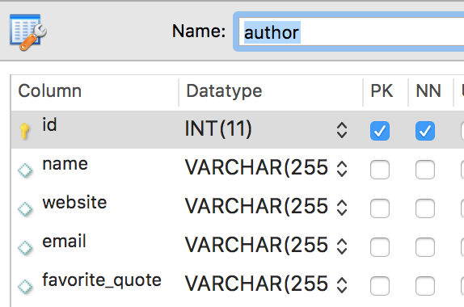
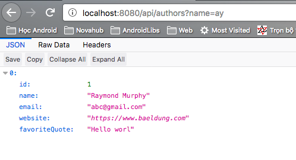

# Database phần 2 - Tùy biến, Query

Xem

- [Cài đặt, sử dụng nhanh](Database-1.md)
- [Dữ liệu quan hệ](Database-3.md)

## 1. Tùy cột trong bảng dữ liệu

Giả sử ta có model như sau

```java
@Entity
@Data
public class Author {

    @Id
    @GeneratedValue(strategy = GenerationType.AUTO)
    private int id;

    private String name;
    private String email;
    private String website;
    private String favoriteQuote;
}
```

Thì tương ứng, ta có được bảng dữ liệu như sau


Ở đây
- @Id : xác định khóa chính của bảng
- @GeneratedValue: Cho biết cột dữ liệu này sẽ được tự tạo giá trị lúc được insert

Ngoài ra, còn có nhiều annotitaion khác có thể thay đổi thuộc tính của các cột, bao gồm

Validation dữ liệu
- @Null/@NotNull: Bắt buộc dữ liệu phải null hoặc khác null thì mới được insert/update
- @Past/@Future: Sử dụng với cột thời gian, quy định dữ liệu phải là một giá trị ở quá khứ hoặc tương lai
- @Min/@Max: Sử dụng với cột số, quy định dữ liệu phải lớn hơn hoặc nhỏ hơn một giá trị nhất định
- @Size: Quy định chiều dài tối thiểu/tối đa của chuỗi
- @Pattern: Sử dụng cho cột String quy định dữ liệu phải phù hợp với pattern

Bổ sung thông tin cột
- @Lob: Cho biết chuỗi có thể có kích thước rất lớn
- @Column: Định nghĩa thông tin cột như tên, sự duy nhất
- @OrderColumn: Cho biết thứ tự các cột trong bảng

Khai báo các quan hệ (Sẽ nghiên cứu kỹ ở phần sau)
- @PrimaryKeyJoinColumn: Chỉ định khóa ngoại
- @PrimaryKeyJoinColumns: Chỉ định tập khóa ngoại
- @ManyToMany: Cho biết quan hệ nhiều - nhiều
- @ManyToOne: Cho biết quan hệ nhiều - một
- @OneToMany: Cho biết quan hệ một - nhiều
- @OneToOne: Cho biết quan hệ một-một
- ...

## 2. Tùy biến các câu lệnh query

Ở phần trước, ta đã biết cách khai báo một repository như sau

```java
public interface AuthorRepository extends CrudRepository<Author, Integer> {
}
```

Những hàm mà một `authorRepository` cung cấp:
- save: lưu (bao gồm cả insert/update) một author
- saveAll: lưu (insert/update) cùng lúc nhiều author
- findById: tìm kiếm một author theo id
- existsById: kiểm tra một id có tồn tại
- findAll: lấy tất cả các author
- findAllById: tìm nhiều author theo danh sách id
- count: lấy lượng author
- deleteById: xóa author bởi id
- delete: xóa author
- deleteAll: xóa author theo danh sách hoặc toàn bộ author

Ngoài ra, ta có thể khai báo thêm các method với tên theo quy tắc và danh sách tham số phù hợp, framework sẽ đi implement giùm. Ví dụ

```java
public interface AuthorRepository extends CrudRepository<Author, Integer> {
    List<Author> findByNameContaining(String name);
}
```

Tên hàm `findByNameContaining` với `findBy` là tìm author theo điều kiện và `NameContaining` tức là tên chứa chuỗi name ở trong param.

Kết quả


### Query bằng tên hàm


Khi đặt tên một hàm trong repository bắt đầu với `find`, `query`, `read`, `get`, `count` và tiếp theo bởi `by` và danh sách từ khóa điều kiện

|Từ khóa|Ý nghĩa|Minh họa bằng sql|
|--- |--- |--- |
|And|Kết hợp AND hai điều kiện|...where lastname = ?1 and firstname = ?2|
|Or|Kết hợp OR hai điều kiện|...where lastname = ?1 or firstname = ?2|
|Is, Equals|Kiểm tra dữ liệu phải bằng|...where name = ?1|
|Between|Kiểm tra dữ liệu trong phạm vi|...where startDate between ?1 and ?|
|LessThan|Dữ liệu nhỏ hơn|...where year < ?1|
|LessThanEqual|Dữ liệu nhỏ hơn hoặc bằng|...where year <= ?1|
|GreaterThan|Dữ liệu lớn hơn|...where year > ?1|
|GreaterThanEqual|Dữ liệu lớn hơn hoặc bằng|...where year >= ?1|
|After|Dữ liệu ngày tháng phải sau|...where startDate > ?1|
|Before|Dữ liệu ngày tháng phải trước|...where startDate < ?1|
|IsNull|Dữ liệu là null|...where name is null|
|IsNotNull, NotNull|Dữ liệu khác null|...where name not null|
|Like|Dữ liệu string hợp pattern|...where name like ?1|
|NotLike|Dữ liệu string không hợp pattern|...where name not like ?1|
|StartingWith|Dữ liệu string bắt đầu với|...where name like ?1|
|EndingWith|Dữ liệu string kết thúc với|...where name like ?1|
|Containing|Dữ liệu string chứa|...where name like ?1|
|OrderBy|Sắp xếp kết quả trả về theo|...where year = ?1 order by name desc|
|Not|Phủ định điều kiện|...where name <> ?1|
|In|Dữ liệu thuộc danh sách|...where year in ?1|
|NotIn|Dữ liệu không thuộc danh sách|...where year not in ?1|
|True|Dữ liệu là true|...where valid = true|
|False|Dữ liệu là false|...where valid = false|
|IgnoreCase|Không kiểm tra chữ hoa thường|...where UPPER(name) = UPPER(?1)|

Ví dụ

```java
import com.voquanghoa.bookstore.models.Author;
import org.springframework.data.repository.CrudRepository;

import java.util.List;

public interface AuthorRepository extends CrudRepository<Author, Integer> {
    List<Author> findByNameContainingIgnoreCase(String name);
    List<Author> findByNameOrEmail(String name, String email);
    List<Author> findByNameContainingOrEmailContaining(String name, String email);
}
```

Bằng cách sử dụng tên hàm, thư viện sẽ generate câu lệnh sql phù hợp.

### Sử dụng Query

Ta chỉ định sql để thực hiện việc query thay vì để thư viện generate dựa theo tên hàm như trên.

```java
import com.voquanghoa.bookstore.models.Author;
import org.springframework.data.jpa.repository.Query;
import org.springframework.data.repository.CrudRepository;

import java.util.List;

public interface AuthorRepository extends CrudRepository<Author, Integer> {
    @Query("select u from Author u where email = ?1")
    List<Author> findByEmailAddress(String emailAddress);
}
```

Ở đây `?1` là giá trị sẽ được thay thế bởi tham số `emailAddress`, hoặc một cách tường minh hơn, giá trị tham số hàm có thể được điền bằng cách dùng tên

```java
public interface AuthorRepository extends CrudRepository<Author, Integer> {
    @Query("select u from Author u where email = :emailAddress")
    List<Author> findByEmailAddress(String emailAddress);
}
```

### Cập nhật dữ liệu

Ta có thể cập nhật dữ liệu với thao tác UPDATE/DELETE bằng query với Annotation @Modifing như sau:

```java
import com.voquanghoa.bookstore.models.Author;
import org.springframework.data.jpa.repository.Modifying;
import org.springframework.data.jpa.repository.Query;
import org.springframework.data.repository.CrudRepository;
import org.springframework.transaction.annotation.Transactional;

public interface AuthorRepository extends CrudRepository<Author, Integer> {

    @Transactional
    @Modifying
    @Query("delete Author where email = :emailAddress")
    void deleteByEmail(String emailAddress);

    @Transactional
    @Modifying
    @Query(value = "update Author set email = :newEmail  where id = :id")
    void updateEmailById(int id, String newEmail);
}
```

@Transactional đảm bảo việc cập nhật (sửa/xóa) thành công mà không bị một thao tác khác xen ngang. Đối với một số trường hợp, đây là annotation phải có để cập nhật dữ liệu.

## Tài liệu tham khảo thêm

https://docs.spring.io/spring-data/jpa/docs/current/reference/html/
https://o7planning.org/vi/11661/huong-dan-spring-boot-jpa-va-spring-transaction
https://www.journaldev.com/17034/spring-data-jpa
https://www.petrikainulainen.net/spring-data-jpa-tutorial/


## Bài tập

1. Thêm thuộc tính `price` và thêm vào Repository phương thức tìm kiếm sách có giá trong phạm vi `min` đến `max`
2. Thay đổi router `/find` để nhận vào một query `q` có thể tìm kiếm book có `name` query `q`
3. Thay đổi router GET "" để nhận vào các optional parametter String `q`, String `order`, String orderType="ASC", thay đổi response dựa theo params.

[Trang chủ](https://voquanghoa.github.io/Spring-Tutorial/)