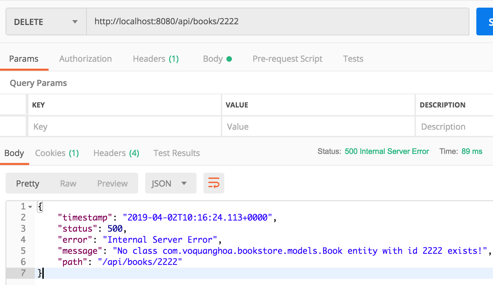
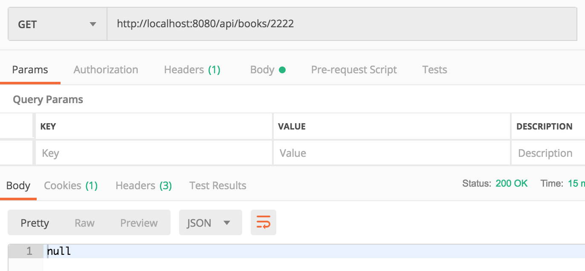
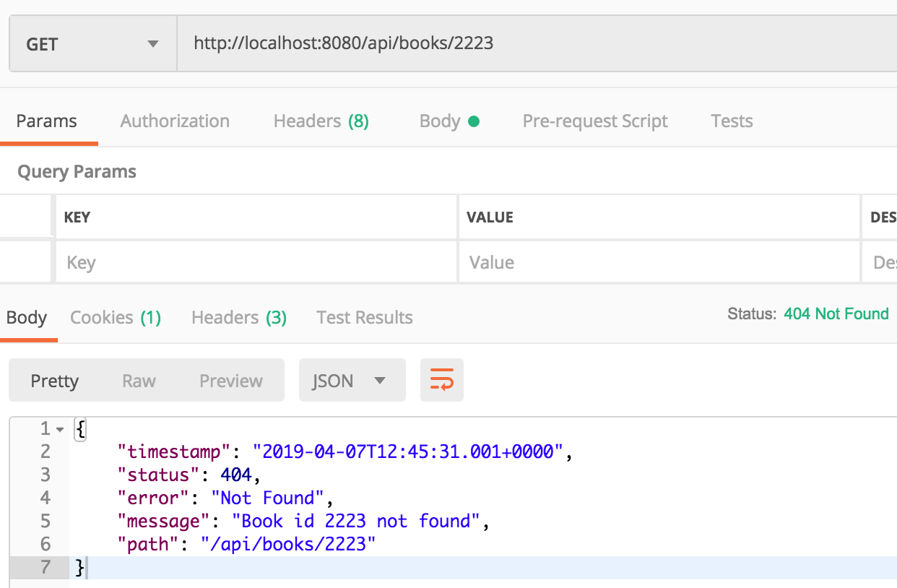

# Exception handling

Một http request thường có những mã response phổ biến như sau

Mã 2xx: Thành công

- 200: Ok. Request hoàn tất, không có lỗi gì
- 201: Created. Giống 200 nhưng có thêm ý nghĩa thông báo dữ liệu đã được tạo
- 202: Accepted. Request chưa hoàn tất, có thể có vài thao tác được tiếp tục nhưng tạm thời mọi thứ đều ổn.
- 204: No Content. Giống 200 nhưng có ý thông báo server sẽ không trả về gì ở phần response body

Mã 3xx: Định hướng
- 301: Moved Permantly. Tài nguyên hiện nằm ở nơi khác
- 304: Not Modified. Thông báo tài nguyên không đổi, phía client không cần cập nhật bản mới. 

Mã 4xx: Lỗi phía client

- 400: Bad request. Thường do dữ liệu client gửi lên không hợp lệ
- 401: Unauthorized. Client thực hiện một thao tác mà không cung cấp thông tin người dùng trong khi Server yêu cầu.
- 403: Forbidden. Client thực hiện một thao tác với thông tin người dùng nhưng phía server từ chối phục vụ người dùng đó với thao tác đó.
- 404: Not found. Client yêu cầu một tài nguyên không tồn tại trên server
- 405: Method Not Allowed. Client yêu cầu một tài nguyên tồn tại trên server nhưng với một method không hợp lệ.

Mã 5xx: Lỗi phía server
- 500: Lỗi không xác định ở server


Việc handle lỗi ở server nhằn tới hai mục đích:

- Thông báo lỗi cho client để client nhận biết lỗi chính xác (Mã lỗi 4xxx).
- Ngăn chặn những tình huống lỗi 5xx xảy ra nhưng không được giấu lỗi để các hoạt động logic được đảm bảo chính xác.

Giả sử rằng ta có controller `BookController` như sau:

```java
import com.voquanghoa.bookstore.models.Book;
import com.voquanghoa.bookstore.repositories.BookRepository;
import org.springframework.beans.factory.annotation.Autowired;
import org.springframework.web.bind.annotation.*;

import java.util.Optional;

@RestController
@RequestMapping("/api/books")
public class BookController {

    @Autowired
    private BookRepository bookRepository;

    @GetMapping("/{id}")
    Optional<Book> get(@PathVariable int id){
        return bookRepository.findById(id);
    }

    @DeleteMapping("/{id}")
    void delete(@PathVariable int id){
        bookRepository.deleteById(id);
    }
}
```

Thực thi request DELETE với id book `2222` không tồn tại, ta nhận được response code 500 và response chứa thông tin về lỗi



Với request GET cũng với id đó, ta được response code 200 và body rỗng



Cả hai trường hợp trên đều không hợp lý, ta cần response mã lỗi 404 và body có thể rỗng hoặc json về lỗi.

Để làm điều đó, ta phải implement exception handle như sau

Tạo package `exceptions` với cấu trúc


File `NotFoundException.java`

```java
import org.springframework.http.HttpStatus;
import org.springframework.web.bind.annotation.ResponseStatus;

@ResponseStatus(code = HttpStatus.NOT_FOUND)
public class NotFoundException extends RuntimeException {
    public NotFoundException(String reason){
        super(reason);
    }
}
```

File `GlobalControllerExceptionHandler.java` 
```java
import lombok.AccessLevel;
import lombok.AllArgsConstructor;
import lombok.Data;
import org.springframework.boot.autoconfigure.condition.ConditionalOnProperty;
import org.springframework.http.HttpStatus;
import org.springframework.http.ResponseEntity;
import org.springframework.web.bind.annotation.ControllerAdvice;
import org.springframework.web.bind.annotation.ExceptionHandler;
import org.springframework.web.context.request.ServletWebRequest;

@Data
@AllArgsConstructor(access = AccessLevel.PUBLIC)
class ErrorModel{
    private String message;
    private String path;
}

@ControllerAdvice
@ConditionalOnProperty(prefix = "app", name = "disable-default-exception-handling")
class GlobalControllerExceptionHandler {

    public ResponseEntity<ErrorModel> handleException(NotFoundException ex, ServletWebRequest request) {
        return new ResponseEntity<>(new ErrorModel(ex.getMessage(), request.getRequest().getRequestURI()), HttpStatus.NOT_FOUND);
    }
}
```
Cập nhật `BookController.java`

```java
@GetMapping("/{id}")
Book get(@PathVariable int id){
    Optional<Book> optionalBook = bookRepository.findById(id);

    if(optionalBook.isPresent()){
        return optionalBook.get();
    }

    throw new NotFoundException(String.format("Book id %d not found", id));
}

@DeleteMapping("/{id}")
void delete(@PathVariable int id){

    if(!bookRepository.existsById(id)){
        throw new NotFoundException(String.format("Book id %d not found", id));
    }

    bookRepository.deleteById(id);
}
```

Kết quả:



Http Response Code = 404

Http Response Body:
```json
{
    "timestamp": "2019-04-07T12:45:31.001+0000",
    "status": 404,
    "error": "Not Found",
    "message": "Book id 2223 not found",
    "path": "/api/books/2223"
}
```
