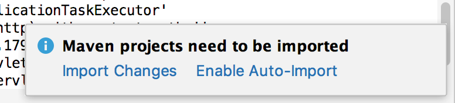
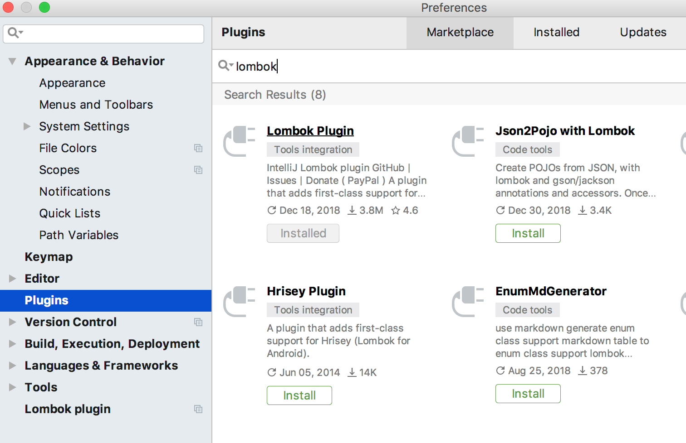

# Sử dụng lombok để đỡ phiền hà

Step 1. Mở file pom.xml từ dự án, chú ý cấu trúc đang có của nó và thêm đoạn này vào

```xml
<dependency>
    <groupId>org.projectlombok</groupId>
    <artifactId>lombok</artifactId>
    <version>1.18.6</version>
    <scope>provided</scope>
</dependency>
```

Chọn Import changes



Trên giao diện IntelliJ IDEA vào menu File --> Preferences --> Tìm và cài đặt plugin Lombok và khởi động lại phần mềm.



Mở file `Book.java`, xóa tất cả các hàm đã được implement và thêm chỉ thị @Data vào như thế này

```java
import lombok.Data;

@Data
public class Book {

    private int id;

    private String name;

    private int year;
}
```

Chạy lại web, kiểm tra mọi thứ vẫn hoạt động ổn.

Sửa tương tự với những class model đang có.
