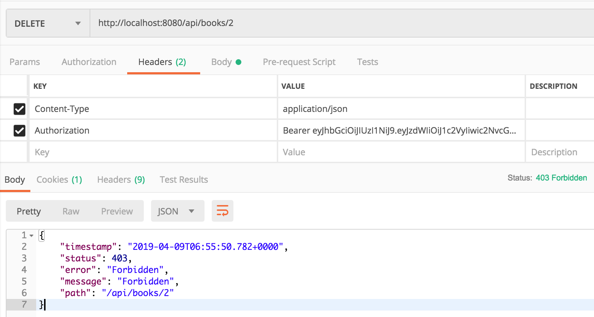
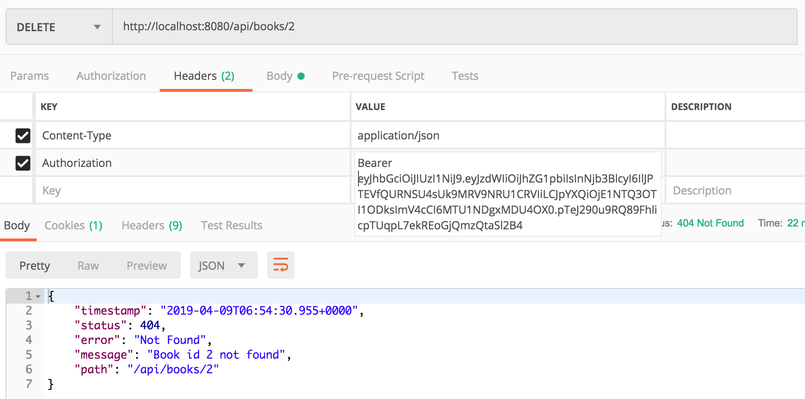

# Security phần 4 - Phân quyền

Xem:

- [Phần 1](Security-1.md)
- [Phần 2](Security-2.md)
- [Phần 3](Security-3.md)

Ở [Phần 2](Security-2.md) ta đã có thể quy định một router `/api/books` bắt buộc phải truy cập được nhưng làm thế nào để cùng một router đó:

- Thao tác GET lấy về list books chỉ cần yêu cầu role là `ROLE_MEMBER`
- Thao tác POST, PUT, DELETE để thêm, sửa, xóa sách thì cần có role `ROLE_ADMIN`

Đầu tiên, ta tạo class `MethodSecurityConfig` trong package `configurations` với nội dung

```java
import org.springframework.context.annotation.Configuration;
import org.springframework.security.config.annotation.method.configuration.EnableGlobalMethodSecurity;
import org.springframework.security.config.annotation.method.configuration.GlobalMethodSecurityConfiguration;

@Configuration
@EnableGlobalMethodSecurity(securedEnabled = true)
public class MethodSecurityConfig extends GlobalMethodSecurityConfiguration {
}
```

Sau đó, quy định thao tác DELETE yêu cầu quyền ROLE_ADMIN mới được truy cập bằng cách thêm annontation `@Secured("ROLE_ADMIN")`

```java
    @Secured("ROLE_ADMIN")
    @DeleteMapping("/{id}")
    void delete(@PathVariable int id){

        if(!bookRepository.existsById(id)){
            throw new NotFoundException(String.format("Book id %d not found", id));
        }

        bookRepository.deleteById(id);
    }
```

Kết quả

Thực hiện login với 2 account `user` và `admin`, dùng jwt token để gửi request DELETE lên `/api/books/2`.

Với token của account `user`, ta nhận được error 403




Với token của account `admin`, ta nhận được error 401 vì sách không tồn tại (việc truy cập là được phép)



Ta cũng có thể áp dụng `@Secured("ROLE_ADMIN")` vào một controller, khi đó, mọi action thuộc controller đó đều bị ảnh hưởng bởi cờ này.

```java

@RestController
@RequestMapping("/api/books")
@Secured("ROLE_ADMIN")
public class BookController {
    
    ......

}
```

Tham khảo thêm
    - https://www.baeldung.com/spring-security-method-security
    - https://docs.spring.io/spring-security/site/docs/4.2.12.BUILD-SNAPSHOT/apidocs/org/springframework/security/access/annotation/Secured.html