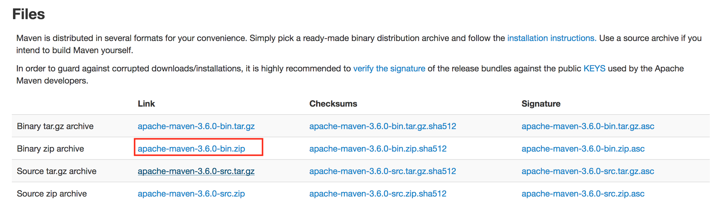
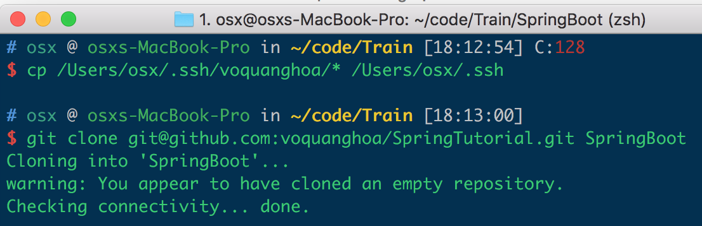

## Các bước cài đặt để làm việc với Spring Boot

### 1. Java

Spring (hay Spring Boot) là framework dựa trên java nên tất nhiên không thể thiếu Java mà cụ thể là Java SDK rồi
Download ở đây https://www.oracle.com/technetwork/java/javase/downloads/jdk8-downloads-2133151.html, chọn đúng phiên bản cho hệ điều hành, download và cài đặt

Sau khi cài đặt Java, mình nên cài đặt đường dẫn java vào biến môi trường PATH. Chi tiết xem ở đây http://programmingloops.com/set-java-path-n-classpath-in-win-10/. Sau khi cài đặt, nếu bạn vào Start --> Run, gõ `java` mà nó ra màn hình đen (vài giây rồi tắt) là ok.

### 2. Maven 

Maven là phần mềm dùng để quản lý project java từ việc cấu hình dự án đến quản lý các thư viện (dependencies) đến các thao tác build, báo cáo, tài liệu.

Download ở đây https://maven.apache.org/download.cgi chọn binary định dạng zip 

Sau khi download về, mình giải nén maven ở một nơi nào đó cố định, set biến môi trường `PATH` tới thư mục `bin`. Sau đó, kiểm tra lại nếu mình vào Start --> Run gõ `mvn` mà nó ra màn hình đen đen là ok

### 3. MySql

MySql là hệ quản trị cơ sở dữ liệu phổ biến cho cả window, linux và mac

Download ở đây https://dev.mysql.com/downloads/mysql/

### 4. IntelliJ IDEA

IntelliJ IDEA là một IDE (Integrated Development Environment) siêu mạnh để phát triển các dự án web. Phiên bản miễn phí Community mặc dù có chút hạn chế về tính năng so với bản có phí Ultimate (đắt lòi ra) nhưng vẫn cực kỳ đủ để mình làm việc thoải mái.

Download: https://www.jetbrains.com/idea/download/

### 5. Git

Git dùng để quản lý mã nguồn, giúp mình có thể lưu mã nguồn rồi quậy phá thoải mái.

### 6. Visual Studio Code

Đừng nhầm với Visual Studio. Visual Studio là một IDEA siêu mạnh, (tất nhiên cũng siêu nặng) còn Visual Studio Code là một code editor khá nhẹ nhàng với nhiều tính năng tương đối mạnh.

Đây là Visual Studio

Còn đây là Visual Studio Code

Đôi lúc mình cần sửa vài file mã nguồn, file cấu hình mà không muốn lôi cái InteliJ IDEA ra vì nó hơi mất thời gian thì Visual Studio Code là giải pháp hợp lý. Nói vậy không có nghĩa là xem thường sức mạnh của Visual Studio Code đâu

### 7. Postman

Postman dùng để tạo và gửi những request api, qua đó mình có thể xem api nó hoạt động như thế nào, đã đúng như ý đồ của mình hay chưa. Nhiều tình huống hệ thống phần mềm bị lỗi, Postman có thể cho mình biết nhanh chóng lỗi đó là của server hay client để tập trung xử lý.

Postman cũng giúp mình hiểu các khái niệm của http request được một các rõ ràng và trực quan.

Download https://www.getpostman.com/downloads/

=== Hết ===