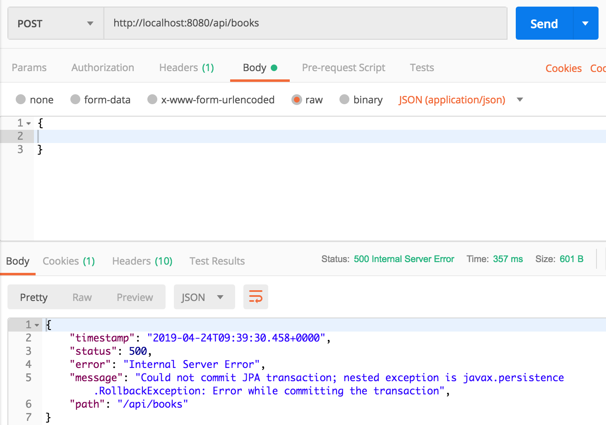
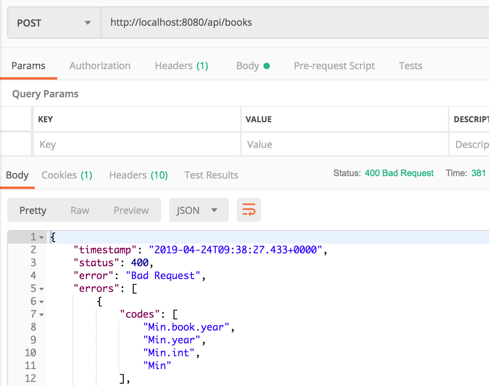

# Validation

## Model validation

Giả sử ta có model Book như sau

```java
import lombok.Data;
import lombok.NoArgsConstructor;
import lombok.NonNull;
import lombok.RequiredArgsConstructor;

import javax.persistence.*;

@Data
@Entity
@NoArgsConstructor
@RequiredArgsConstructor
public class Book {

    @Id
    @GeneratedValue(strategy= GenerationType.AUTO)
    private int id;

    @NonNull
    private String name;

    @ManyToOne
    private Author author;

    private int year;
}
```

Ta có thể lưu dữ liệu với tên sách rỗng, thông tin year là 0. Để khắc phục chuyện đó, ta cần thêm các annontation như sau

```java
import lombok.Data;
import lombok.NoArgsConstructor;
import lombok.NonNull;
import lombok.RequiredArgsConstructor;

import javax.persistence.*;
import javax.validation.constraints.Max;
import javax.validation.constraints.Min;
import javax.validation.constraints.NotBlank;

@Data
@Entity
@NoArgsConstructor
@RequiredArgsConstructor
public class Book {

    @Id
    @GeneratedValue(strategy= GenerationType.AUTO)
    private int id;

    @NonNull
    @NotBlank(message = "Name is mandatory")
    private String name;

    @ManyToOne
    private Author author;

    @Min(value = 1990, message = "Invalid year")
    @Max(value = 2100, message = "Invalid year")
    private int year;
}
```

Ở đây:

- @Min, @Max: quy định giá trị tối thiểu, tối đa của số
- @NotBlank: quy định chuổi phải không rỗng và cũng không được là toàn khoảng trắng.

Ngoài ra:

- @NotEmpty: Quy định chuổi không được rỗng (chấp nhận khoảng trắng)
- @NotNull: Quy định chuổi không được null

Chi tiết về toàn bộ các annotation có thể xem ở đây [https://javaee.github.io/javaee-spec/javadocs/javax/validation/constraints/package-summary.html](https://javaee.github.io/javaee-spec/javadocs/javax/validation/constraints/package-summary.html).

Testing:

```java

import com.voquanghoa.bookstore.models.Book;
import org.junit.Test;
import org.junit.runner.RunWith;
import org.springframework.beans.factory.annotation.Autowired;
import org.springframework.boot.autoconfigure.EnableAutoConfiguration;
import org.springframework.boot.test.autoconfigure.web.servlet.AutoConfigureMockMvc;
import org.springframework.boot.test.context.SpringBootTest;
import org.springframework.test.context.junit4.SpringRunner;
import org.springframework.test.context.web.WebAppConfiguration;

import javax.validation.Validator;

import static junit.framework.TestCase.assertFalse;
import static junit.framework.TestCase.assertTrue;

@RunWith(SpringRunner.class)
@SpringBootTest
@AutoConfigureMockMvc
@WebAppConfiguration
@EnableAutoConfiguration(exclude = {org.springframework.boot.autoconfigure.gson.GsonAutoConfiguration.class})
public class BookTest {

    @Autowired
    private Validator validator;

    @Test
    public void test_book_OK(){
        Book book = new Book();
        book.setName("Hello");
        book.setYear(2010);
        assertTrue(validator.validate(book).isEmpty());
    }

    @Test
    public void test_book_year_under_1990(){
        Book book = new Book();
        book.setName("Hello");
        book.setYear(1989);
        assertFalse(validator.validate(book).isEmpty());
    }

    @Test
    public void test_book_year_above_2100(){
        Book book = new Book();
        book.setName("Hello");
        book.setYear(2101);
        assertFalse(validator.validate(book).isEmpty());
    }

    @Test
    public void test_book_invalid_name(){
        Book book = new Book();
        book.setName("");
        book.setYear(2000);
        assertFalse(validator.validate(book).isEmpty());
    }
}
```

## Controller validation

Với việc thêm Model validation, khi ta thực hiện việc lưu dữ liệu từ controller thì sẽ bị lỗi như sau

```java
@PostMapping()
public void post(@RequestBody Book book){
    book.setId(0);
    bookRepository.save(book);
}
```



Do đó, ta cần thêm annotation `@Valid` để dữ liệu phải được validate trước khi thực hiện.

```java
@PostMapping()
public void post(@Valid @RequestBody Book book){
    book.setId(0);
    bookRepository.save(book);
}
```

Kết quả



Testing

```java

    @Test
    public void test_post_ok() throws Exception{

        Gson gson = new Gson();
        Book bookPost = new Book();
        bookPost.setYear(2001);
        bookPost.setName("Geometry");

        String json = gson.toJson(bookPost);

        mockMvc.perform(put("/api/books")
                .contentType(MediaType.APPLICATION_JSON).content(json))
                .andExpect(status().isOk());


        ArrayList<Book> books = (ArrayList<Book>) bookRepository.findAll();
        Book book = books.get(books.size()-1);

        assertEquals (book.getName(), "Geometry");
    }

    @Test
    public void test_post_not_ok() throws Exception{

        Gson gson = new Gson();
        Book bookPost = new Book();


        mockMvc.perform(post("/api/books")
                .contentType(MediaType.APPLICATION_JSON).content(gson.toJson(bookPost)))
                .andExpect(status().isBadRequest());

        bookPost.setName("Math");
        mockMvc.perform(post("/api/books")
                .contentType(MediaType.APPLICATION_JSON).content(gson.toJson(bookPost)))
                .andExpect(status().isBadRequest());

        bookPost.setYear(1900);
        mockMvc.perform(post("/api/books")
                .contentType(MediaType.APPLICATION_JSON).content(gson.toJson(bookPost)))
                .andExpect(status().isBadRequest());

        bookPost.setYear(2101);
        mockMvc.perform(post("/api/books")
                .contentType(MediaType.APPLICATION_JSON).content(gson.toJson(bookPost)))
                .andExpect(status().isBadRequest());
    }
```

[Trang chủ](https://voquanghoa.github.io/Spring-Tutorial/)

